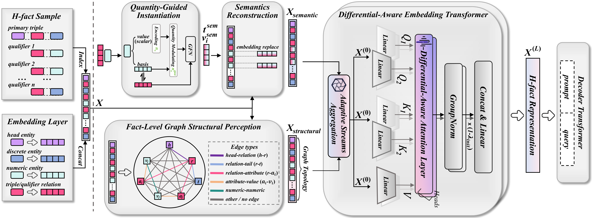

## Experiment Environment
- numpy==1.21.5
- tqdm==4.64.0
- torch==1.12.0+cu113

## NumDAE Hyperparameters

*HN-WK*

embedding_dim: 256, num_layer: 4, num_head: 8, hidden_dim: 2048, dropout: 0.15, batch_size: 1024

*HN-YG*

embedding_dim: 256, num_layer: 2, num_head: 8, hidden_dim: 1536, dropout: 0.4, batch_size: 2048

*HN-FB-S*

embedding_dim: 256, num_layer: 3, num_head: 8, hidden_dim: 1024, dropout: 0.3, batch_size: 512

